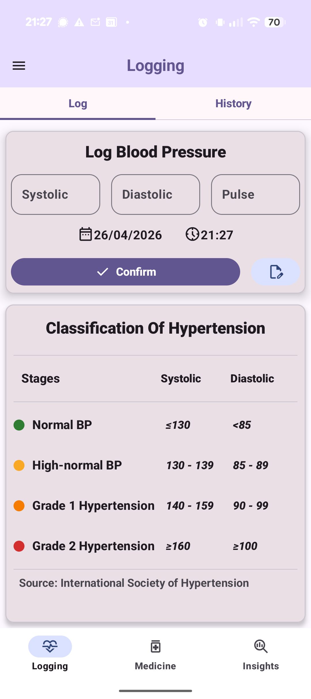
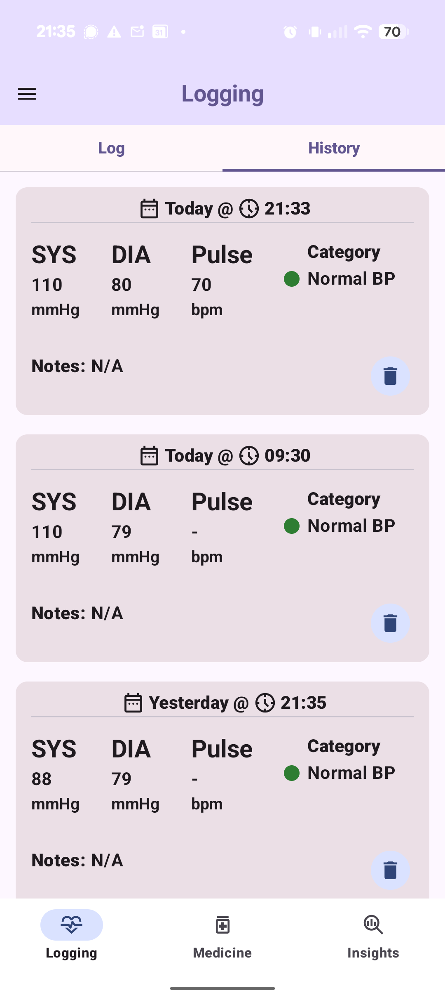
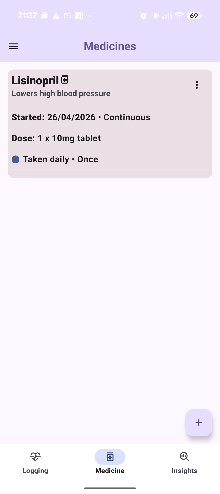
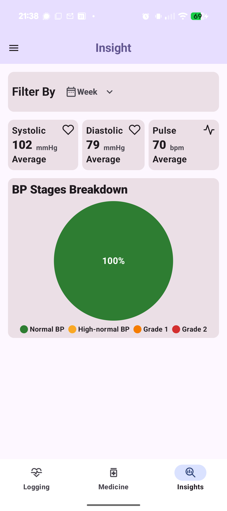
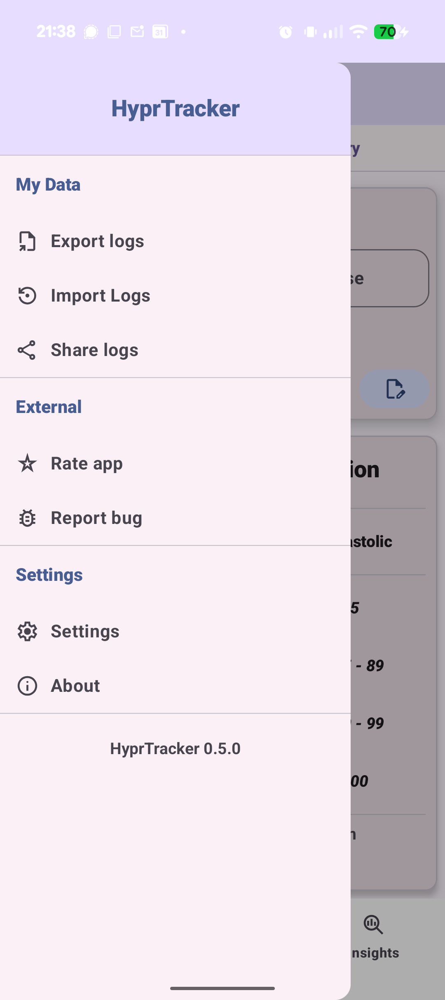
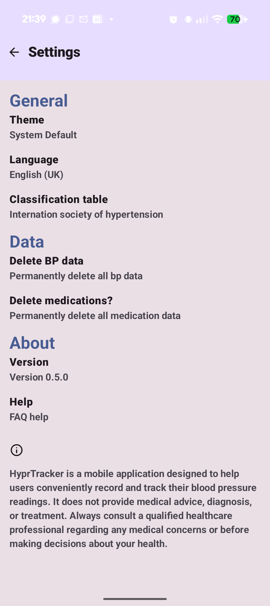

# HyprTracker

HyprTracker is a **free and open-source Android application** for recording, managing, and analyzing blood pressure readings. Designed with a clean **Material Design 3** interface and built entirely in **Kotlin**, the app provides a simple way to track cardiovascular health while keeping medication and historical data organized in one place.

Whether you need to monitor daily readings, review long-term trends, or manage medications alongside your health data, HyprTracker aims to provide an intuitive and privacy-focused experience.

## Key Features

- Log systolic, diastolic, and optional pulse readings
- Edit previous entries with custom notes, date, and time
- Track medications with dosage and scheduling details
- View trends with weekly, monthly, and all-time insights
- Analyze averages, minimums, and maximums
- Visualize hypertension stages with chart-based summaries
- Import and export data in CSV format *(in active development)*
- Submit bug reports and app feedback directly within the app
- Customize preferences through a dedicated settings page

HyprTracker is built to make blood pressure tracking more accessible, organized, and user-friendly.

## Screenshots

  
  
  

  
  
  

